# CFX.re C# Development Boilerplate
C# boilerplate for development on cfx.re mods (_FiveM_ and _RedM_)

**This boilerplate consists of**:
1. Setup a C#.NET Class Library project for both Client and Server
2. Target the correct .NET Framework (which is at version 4.5.2 at this time)
3. Add corresponding NuGet CitizenFX packages.
4. Setup packages to not copy themselves locally on build
5. Configure Debugging for both Client and Server projects
6. Set up shared script compilation for both projects.
7. Setup build output path

Anyway, follow the images. Otherwise, use the boilerplate as it is.

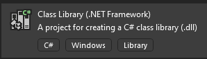
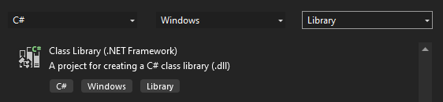
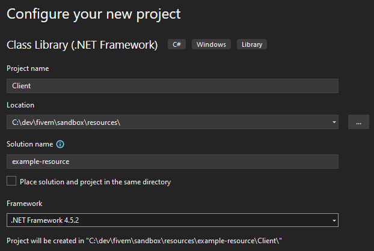
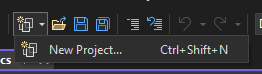
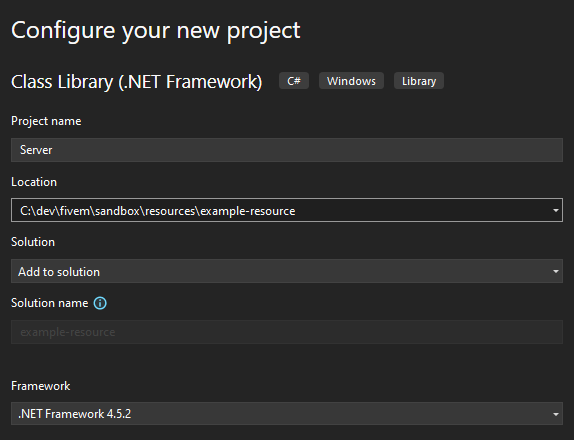
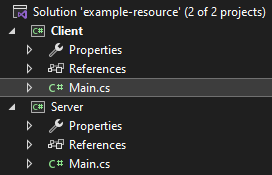
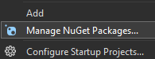
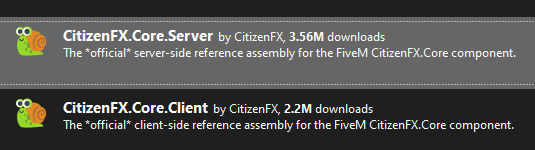

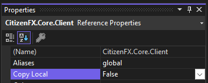

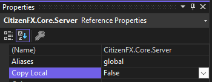
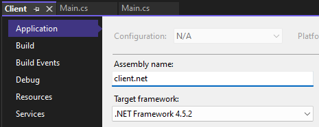
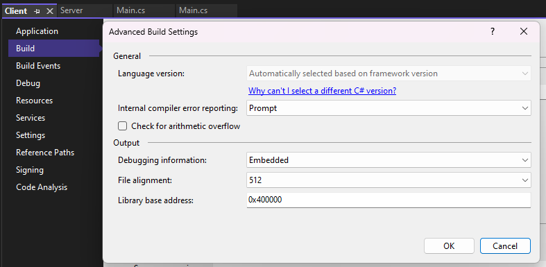
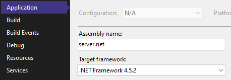
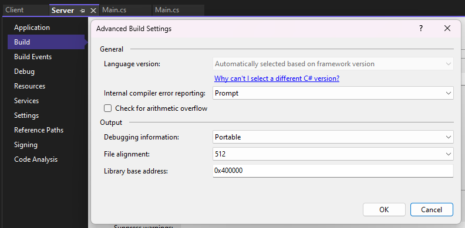

Join the [FiveM Scripters](https://discord.com/invite/KKN7kRT2vM) discord server.
